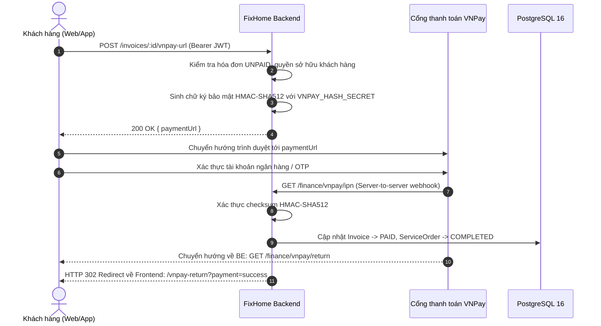

# FixHome API — Payments & Public Tracking Specification

> **Base Path**: `/api/v1`  
> **Auth**: Bearer JWT (Đối với endpoints thanh toán bảo mật); Public (Đối với VNPay callback & Public Order Tracking)  
> **Standard Response**: `{ "success": boolean, "statusCode": number, "message": string, "data": any }`

---

## 1. VNPay Online Payment Integration

Hệ thống FixHome hỗ trợ cổng thanh toán VNPay dành cho hóa đơn dịch vụ (`invoices`), hoạt động song song với phương thức thanh toán tiền mặt 2 chiều (Cash Dual-Confirmation).



### 1.1 Tạo URL Thanh toán VNPay
- **Endpoint**: `POST /api/v1/invoices/:id/vnpay-url`
- **Roles**: `customer` (chủ sở hữu đơn hàng)
- **Header**: `Authorization: Bearer <access_token>`
- **Response (200 OK)**:
  ```json
  {
    "success": true,
    "statusCode": 200,
    "data": {
      "paymentUrl": "https://sandbox.vnpayment.vn/paymentv2/vpcpay.html?vnp_Amount=35000000&vnp_Command=pay&vnp_CreateDate=20260924131500&vnp_CurrCode=VND&vnp_IpAddr=127.0.0.1&vnp_Locale=vn&vnp_OrderInfo=Thanh+toan+hoa+don+INV-123&vnp_OrderType=other&vnp_ReturnUrl=http%3A%2F%2Flocalhost%3A3000%2Ffinance%2Fvnpay%2Freturn&vnp_TmnCode=FIXHOME1&vnp_TxnRef=INV-123-1727150100&vnp_Version=2.1.0&vnp_SecureHash=abcdef..."
    }
  }
  ```

### 1.2 VNPay Return URL (Trình duyệt chuyển hướng về)
- **Endpoint**: `GET /api/v1/finance/vnpay/return`
- **Auth**: Public (Chuyển tiếp từ VNPay sau khi khách hàng nhập mã xác nhận ngân hàng)
- **Tham số Query**: `vnp_Amount`, `vnp_BankCode`, `vnp_CardType`, `vnp_OrderInfo`, `vnp_PayDate`, `vnp_ResponseCode`, `vnp_TmnCode`, `vnp_TransactionNo`, `vnp_TxnRef`, `vnp_SecureHash`
- **Hành vi máy chủ**:
  1. Lấy toàn bộ tham số bắt đầu bằng `vnp_` (ngoại trừ `vnp_SecureHash`).
  2. Sắp xếp thứ tự alphabet các khóa, tạo chuỗi hash-data URL-encoded.
  3. Băm HMAC-SHA512 với `VNPAY_HASH_SECRET`.
  4. Đối chiếu mã hash: Nếu khớp và `vnp_ResponseCode === '00'`, đánh dấu hóa đơn thanh toán thành công.
  5. Chuyển hướng người dùng về `${FRONTEND_URL}/vnpay-return?payment=success&orderId=...&invoiceId=...`.

### 1.3 VNPay IPN (Instant Payment Notification — Webhook ngầm)
- **Endpoint**: `GET /api/v1/finance/vnpay/ipn`
- **Auth**: Public
- **Mục tiêu**: Nguồn thẩm quyền tối cao xác nhận giao dịch thành công của VNPay.
- **Phản hồi chuẩn VNPay**:
  ```json
  { "RspCode": "00", "Message": "Confirm Success" }
  ```

---

## 2. Public Order Tracking (Tra cứu đơn hàng không cần đăng nhập)

Phục vụ khách hàng hoặc người thân tra cứu tình trạng thực tế của đơn hàng, tiến độ di chuyển của thợ mà không cần đăng nhập hệ thống.

### 2.1 Tra cứu tiến độ đơn hàng
- **Endpoint**: `GET /api/v1/orders/track?code=:orderCode&phone=:customerPhone`
- **Auth**: Public
- **Quy tắc an ninh**: Bắt buộc cả `code` (mã đơn) và `phone` (số điện thoại khách đặt đơn) phải khớp chính xác trên cơ sở dữ liệu để chống duyệt đơn tùy tiện.
- **Response (200 OK)**:
  ```json
  {
    "success": true,
    "statusCode": 200,
    "data": {
      "orderId": "099a888c-7f5b-4c07-b371-3cb523f03b01",
      "orderCode": "ORD-20260924-001",
      "status": "EN_ROUTE",
      "serviceName": "Vệ sinh máy lạnh treo tường Inverter",
      "customerAddress": "123 Nguyễn Thị Minh Khai, Phường Bến Thành, Quận 1",
      "scheduledDate": "2026-09-24",
      "scheduledTimeSlot": "14:00 - 16:00",
      "technician": {
        "fullName": "Trần Văn B",
        "phoneNumber": "0987654321",
        "avatarUrl": "https://res.cloudinary.com/.../avatar.jpg",
        "rating": 4.9,
        "ratingCount": 58,
        "currentLatitude": 10.7769,
        "currentLongitude": 106.7009
      },
      "timeline": [
        { "status": "REQUESTED", "note": "Khách hàng khởi tạo lịch hẹn", "createdAt": "2026-09-24T10:00:00.000Z" },
        { "status": "ACCEPTED", "note": "Kỹ thuật viên nhận việc", "createdAt": "2026-09-24T10:05:00.000Z" },
        { "status": "EN_ROUTE", "note": "Kỹ thuật viên đang di chuyển tới nhà khách", "createdAt": "2026-09-24T13:30:00.000Z" }
      ]
    }
  }
  ```
- **Error (404 Not Found)**:
  ```json
  {
    "success": false,
    "statusCode": 404,
    "message": "Không tìm thấy đơn hàng khớp với mã đơn và số điện thoại đã cung cấp"
  }
  ```
