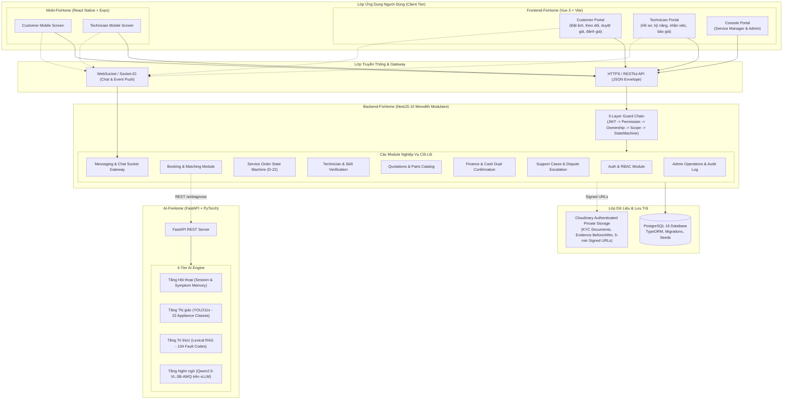

# FixHome — Hệ Sinh Thái Toàn Diện & Cấu Trúc Chi Tiết Từng File (BE, FE, AI, Mobile)

> **Tài liệu đặc tả kiến trúc và cấu trúc mã nguồn toàn diện cho đồ án tốt nghiệp SEP490**  
> **Phiên bản:** Master Architecture Specification v2.1 (Cập nhật: 2026-09-25 — Notification Bell, Evidence Gallery, Auto-dispatch Notifications)  
> **Các phân hệ trong hệ sinh thái:**
> 1. `Backend-FixHome` (Core API, Business Logic, State Machine, PostgreSQL, NestJS)
> 2. `Frontend-FixHome` (Multi-portal Web Application, Vue 3, Vite, TailwindCSS)
> 3. `AI-FixHome` (Advisory Diagnosis Service, 4-tier Engine, YOLO11s, Qwen2.5-VL, FastAPI)
> 4. `Mobi-FixHome` (Cross-platform Mobile Application, React Native, Expo 57)
> 5. `Docs-FixHome` (Trung tâm tài liệu, đặc tả kỹ thuật, báo cáo audit, kiểm thử)

---

## 1. Sơ Đồ Kiến Trúc Hệ Thống Tổng Thể



---

## 2. Phân Hệ Backend (`Backend-FixHome`)

### 2.1 Tổng Quan Công Nghệ & Nguyên Lý Thiết Kế
- **Framework:** NestJS 10 (TypeScript 5.x)
- **Kiến trúc:** Modular Monolith theo Clean Architecture / DDD nguyên tắc.
- **ORM & Database:** TypeORM 0.3.x kết nối PostgreSQL 16. Sử dụng Migration tường minh, nghiêm cấm `synchronize: true` trên production/staging.
- **Bảo mật & Phân quyền:**
  - JWT kép: Access Token (15 phút, stateless) và Refresh Token (7 ngày, mã băm SHA-256 lưu trong bảng `refresh_tokens`).
  - Chuỗi kiểm soát 5 lớp (**5-Layer Guard Chain**):
    1. `JwtAuthGuard`: Xác thực chữ ký token và kiểm tra account status (`active`).
    2. `PermissionGuard`: Kiểm tra quyền chi tiết đọc từ database bảng `role_permissions` với bộ nhớ đệm 60s (`RbacService`).
    3. `OwnershipGuard`: Đảm bảo chỉ chủ sở hữu tài nguyên (Customer tạo đơn / Technician được phân công) mới thao tác được trên tài nguyên; ngăn lộ thông tin nhạy cảm.
    4. `ScopeGuard`: Kiểm tra phạm vi quản lý theo địa bàn quận/huyện của nhân viên vận hành (`UserScope`).
    5. `StateMachineGuard`: Đảm bảo các chuyển dịch trạng thái đơn dịch vụ tuân thủ ma trận State Machine D-22.
- **Khóa dữ liệu chống race condition:** Sử dụng `pessimistic_write` row lock khi nhiều thợ cùng nhận lời mời việc (`invitations.service.ts`), khi tạo đơn hoặc khi xác nhận thanh toán.
- **Chuẩn hóa phản hồi API:** Chuẩn envelop `{ data: T, meta?: object }` và lỗi `{ error: { code: string, message: string, details?: any } }`.

---

### 2.2 Cấu Trúc Thư Mục & Vai Trò Từng File (`Backend-FixHome/src/`)

```
Backend-FixHome/src/
├── main.ts                           # Điểm khởi chạy NestJS, cấu hình global pipes, filter, interceptors
├── setup-app.ts                      # Cấu hình CORS, Swagger OpenAPI v3, Helmet, validation rules
├── app.module.ts                     # Root module kết nối database, config, và 27 business modules
│
├── common/                           # Thành phần dùng chung toàn hệ thống
│   ├── decorators/
│   │   ├── current-user.decorator.ts      # @CurrentUser() trích xuất payload user đã xác thực
│   │   ├── require-permission.decorator.ts# @RequirePermission('resource:action')
│   │   └── roles.decorator.ts             # @Roles(Role.ADMIN, ...)
│   ├── exceptions/
│   │   └── business.exception.ts          # BusinessException ném lỗi kèm ErrorCodes chuẩn hóa
│   ├── filters/
│   │   └── http-exception.filter.ts       # Global filter bắt mọi exception và định dạng envelope lỗi
│   ├── guards/
│   │   ├── jwt-auth.guard.ts              # Lớp bảo vệ JWT
│   │   ├── permission.guard.ts            # Lớp bảo vệ quyền RBAC động từ DB
│   │   ├── ownership.guard.ts             # Lớp bảo vệ quyền sở hữu đơn/tài nguyên
│   │   ├── roles.guard.ts                 # Lớp bảo vệ theo vai trò cơ bản
│   │   └── scope.guard.ts                 # Lớp bảo vệ phạm vi địa bàn nhân viên
│   └── interceptors/
│       └── transform.interceptor.ts       # Tự động wrap payload trả về vào { data: ... }
│
├── config/                           # Cấu hình biến môi trường
│   ├── configuration.ts              # Loader đọc biến .env (Database, JWT, Mail, Supabase)
│   └── env.validation.ts             # Kiểm tra schema biến môi trường bằng Joi/class-validator
│
├── database/                         # Tầng lưu trữ cơ sở dữ liệu
│   ├── base.entity.ts                # BaseEntity định nghĩa id (UUID v4), createdAt, updatedAt
│   ├── data-source.ts                # TypeORM DataSource cấu hình migration CLI
│   ├── migrations/                   # Các file migration SQL định danh theo timestamp
│   │   ├── 1725891000000-Phase0Bootstrap.ts            # Khởi tạo bảng roles, permissions, role_permissions
│   │   ├── 1725892000000-Phase1AuthUsers.ts            # Khởi tạo bảng users, addresses, technician_profiles
│   │   ├── 1725893000000-Phase2Catalog.ts              # Khởi tạo categories, services
│   │   ├── 1725894000000-Phase3BookingsOrders.ts       # Khởi tạo bookings, service_orders, assignments
│   │   ├── 1725895000000-SpecV12PricingAndSettlement.ts# Bảng báo giá, phát sinh, thanh toán, hoa hồng
│   │   ├── 1726800000000-AdditionalCostEvidence.ts     # Thêm ảnh bằng chứng chi phí phát sinh
│   │   └── 1726900000000-TechnicianSkillVerification.ts# Thêm bảng duyệt kỹ năng chuyên môn thợ
│   └── seeds/                        # Dữ liệu hạt giống cho môi trường phát triển & test
│       ├── run-seed.ts               # Runner thực thi toàn bộ seeds
│       ├── seed-rbac.ts              # Nạp 4 roles, 56 permissions, 119 role-permission mappings
│       ├── seed-users.ts             # Tạo tài khoản demo: Admin, Service Manager, Kỹ thuật viên, Khách
│       ├── seed-catalog.ts           # Tạo danh mục dịch vụ, linh kiện và kỹ năng thợ demo
│       └── seed-parts-catalog.ts     # Nạp danh mục linh kiện chính hãng FixHome
│
├── modules/                          # 27 Modules nghiệp vụ phân rã độc lập
│   ├── auth/                         # Xác thực tài khoản & Quản lý phiên đăng nhập
│   │   ├── auth.controller.ts        # POST /auth/register, /login, /refresh, /logout, /forgot-password
│   │   ├── auth.service.ts           # Logic mã hóa bcrypt, sinh JWT, xoay vòng refresh token, OTP
│   │   ├── strategies/jwt.strategy.ts# Passport JWT Strategy xác thực bearer token
│   │   └── entities/
│   │       ├── refresh-token.entity.ts # Lưu token hash, family, expiresAt, revokedAt
│   │       └── otp-verification.entity.ts # Lưu mã OTP xác thực email/đổi mật khẩu
│   │
│   ├── users/                        # Quản lý hồ sơ người dùng & Địa chỉ
│   │   ├── users.controller.ts       # Quản lý tài khoản
│   │   ├── admin-users.controller.ts # Admin quản lý tài khoản & Onboard thợ mới
│   │   ├── addresses.controller.ts   # CRUD sổ địa chỉ của khách hàng (kèm tọa độ lat/lng)
│   │   ├── users.service.ts          # Cập nhật thông tin cá nhân, khóa/mở khóa tài khoản
│   │   └── entities/
│   │       ├── user.entity.ts        # Thông tin cốt lõi (email, phone, fullName, role, status)
│   │       └── address.entity.ts     # Địa chỉ gồm line1, district, province, lat, lng, isDefault
│   │
│   ├── rbac/                         # Hệ thống phân quyền động
│   │   ├── rbac.service.ts           # Quản lý quyền, cache 60s, kiểm tra hasPermission(role, perm)
│   │   └── entities/
│   │       ├── role.entity.ts        # 'customer', 'technician', 'service_manager', 'admin'
│   │       ├── permission.entity.ts  # Mã quyền dạng 'resource:action'
│   │       ├── role-permission.entity.ts
│   │       └── user-scope.entity.ts  # Định danh phạm vi địa bàn của Manager
│   │
│   ├── technicians/                  # Hồ sơ chuyên môn & Lịch làm việc của Kỹ thuật viên
│   │   ├── technicians.controller.ts # GET /profile, PATCH /schedule, POST /skills
│   │   ├── technicians.service.ts    # Tính điểm uy tín, cập nhật trạng thái rảnh/bận (isAvailable)
│   │   └── entities/
│   │       ├── technician-profile.entity.ts      # Rating, số đơn hoàn thành, trạng thái duyệt KYC
│   │       ├── technician-skill.entity.ts        # Kỹ năng sửa chữa, giá niêm yết, verification_status
│   │       ├── technician-service-area.entity.ts # Quận/huyện nhận phục vụ
│   │       ├── technician-schedule.entity.ts     # Ca làm việc cố định theo thứ trong tuần
│   │       └── technician-time-off.entity.ts     # Lịch nghỉ phép đột xuất
│   │
│   ├── technician-verifications/     # Quy trình xét duyệt KYC Kỹ thuật viên
│   │   ├── technician-verifications.controller.ts # Nộp CCCD, ảnh chân dung, Admin duyệt/từ chối
│   │   ├── kyc-storage.service.ts    # Tích hợp Supabase Private Bucket, sinh signed URL
│   │   └── entities/
│   │       ├── technician-verification.entity.ts  # Đơn duyệt KYC, trạng thái PENDING/VERIFIED/REJECTED
│   │       └── verification-document.entity.ts    # Lưu storage path, MIME, dung lượng file
│   │
│   ├── technician-skill-verifications/ # Quy trình xét duyệt kỹ năng chuyên môn thợ (Mới)
│   │   ├── technician-skill-verifications.controller.ts       # Thợ nộp chứng chỉ kỹ năng
│   │   ├── admin-technician-skill-verifications.controller.ts # Admin duyệt/từ chối kỹ năng
│   │   └── technician-skill-verifications.service.ts          # Cập nhật verification_status của skill
│   │
│   ├── technician-assignment/        # Điều phối & phân công thợ
│   │   ├── technician-assignment.controller.ts # SM/Admin phân công thợ thủ công cho đơn
│   │   └── technician-assignment.service.ts    # Gán thợ trực tiếp, ghi đè phân công
│   │
│   ├── bookings/                     # Đặt lịch sửa chữa & Tìm kiếm thợ
│   │   ├── bookings.controller.ts    # POST /bookings, GET /candidates, POST /shortlist, PATCH /schedule
│   │   ├── bookings.service.ts       # Tạo đơn đặt lịch, chụp snapshot địa chỉ/giá, tìm thợ gần nhất
│   │   ├── invitations.service.ts    # Mời thợ tuần tự (sequential dispatch), timeout tự chuyển thợ kế
│   │   ├── technician-eligibility.ts # Hàm kiểm tra 10 điều kiện nghiêm ngặt để thợ được nhận việc
│   │   └── entities/
│   │       ├── booking.entity.ts            # Thông tin đặt lịch, snapshot dịch vụ, trạng thái
│   │       ├── booking-invitation.entity.ts # Lời mời việc theo thứ tự ưu tiên (priorityOrder)
│   │       └── booking-media.entity.ts      # Ảnh/video mô tả sự cố ban đầu của khách
│   │
│   ├── service-orders/               # Vòng đời Đơn Dịch Vụ (State Machine D-22)
│   │   ├── service-orders.controller.ts # Chuyển trạng thái: en-route, check-in GPS, evidence, complete
│   │   ├── service-orders.service.ts    # Kiểm tra geofence (<500m), chốt chặn ảnh BEFORE/AFTER
│   │   └── entities/
│   │       ├── service-order.entity.ts          # Mã đơn FH-YYYYMMDD-XXXX, status, tổng tiền
│   │       ├── technician-assignment.entity.ts  # Ghi nhận lịch sử thợ phụ trách đơn
│   │       ├── order-status-history.entity.ts   # Nhật ký kiểm toán mọi bước chuyển trạng thái
│   │       ├── order-evidence.entity.ts         # Lưu link ảnh BEFORE (trước sửa) & AFTER (sau sửa)
│   │       └── check-in.entity.ts               # Lưu tọa độ GPS, độ chính xác, kết quả geofencing
│   │
│   ├── quotations/                   # Báo giá thực tế & Chi phí phát sinh tại chỗ
│   │   ├── quotations.controller.ts  # Thợ tạo báo giá khảo sát, khách duyệt/từ chối; nộp chi phí phát sinh
│   │   ├── quotations.service.ts     # Tính toán giá công, giá linh kiện, kiểm tra tính bất biến
│   │   └── entities/
│   │       ├── quotation.entity.ts              # Báo giá khảo sát chính thức
│   │       ├── quotation-item.entity.ts         # Từng hạng mục công hoặc linh kiện FixHome/thợ
│   │       └── additional-cost-request.entity.ts# Yêu cầu phát sinh kèm ảnh chụp bằng chứng
│   │
│   ├── finance/                      # Tài chính, Cổng VNPay & Công nợ nền tảng
│   │   ├── finance.controller.ts     # Platform dues list & finance admin
│   │   ├── finance.service.ts        # Chốt chặn Cash Dual-Confirmation & VNPay reconciliation
│   │   ├── vnpay/
│   │   │   ├── vnpay.controller.ts   # VNPay IPN webhook & return URL callback
│   │   │   └── vnpay.util.ts         # Sinh URL thanh toán & kiểm tra chữ ký HMAC-SHA512
│   │   └── entities/
│   │       ├── invoice.entity.ts                # Hóa đơn thanh toán hoàn tất
│   │       ├── commission-due.entity.ts         # Khoản nợ hoa hồng thợ phải hoàn trả FixHome
│   │       └── payment-attempt.entity.ts        # Ghi nhận lần giao dịch thanh toán
│   │
│   ├── media/                        # Lưu trữ Cloudinary riêng tư & cấp URL chữ ký
│   │   ├── media.controller.ts       # Upload ảnh đặt lịch, upload media công khai
│   │   ├── media.service.ts          # Lưu trữ tệp tin trên Cloudinary
│   │   ├── order-evidence-storage.service.ts       # Quản lý ảnh bằng chứng sửa chữa với signed URLs & xóa ảnh
│   │   └── private-booking-photo-storage.service.ts# Quản lý ảnh đặt lịch riêng tư
│   │
│   ├── reviews/                      # Đánh giá & Phản hồi sau dịch vụ
│   │   ├── reviews.controller.ts     # POST /reviews (1 lần/đơn), Admin kiểm duyệt
│   │   ├── reviews.service.ts        # Cập nhật điểm rating trung bình vào hồ sơ thợ
│   │   └── entities/review.entity.ts # Rating 1-5 sao, bình luận, ảnh đính kèm
│   │
│   ├── support-cases/                # Hỗ trợ sự cố & Giải quyết tranh chấp
│   │   ├── support-cases.controller.ts # Khách/Thợ mở case, Service Manager xử lý
│   │   ├── support-cases.service.ts    # Phân loại tranh chấp tiền mặt (CASH_DISPUTE), bảo hành
│   │   └── entities/support-case.entity.ts # Ticket hỗ trợ, lịch sử trao đổi, kết quả xử lý
│   │
│   ├── parts-catalog/                # Danh mục linh kiện chính hãng FixHome
│   │   ├── parts-catalog.controller.ts # Quản lý danh mục linh kiện, giá và thông số
│   │   ├── parts-catalog.service.ts    # Tra cứu linh kiện khi thợ tạo báo giá
│   │   └── entities/part-catalog.entity.ts # SKU, tên linh kiện, giá niêm yết, thời hạn bảo hành
│   │
│   ├── categories/ & services/       # Danh mục ngành nghề & Bảng giá niêm yết
│   │   ├── categories.controller.ts  # CRUD phân cấp danh mục
│   │   ├── services.controller.ts    # Dịch vụ FIXED_PRICE hoặc INSPECTION_REQUIRED
│   │   └── entities/service.entity.ts# Thời gian dự kiến, giá sàn, mô tả quy chuẩn
│   │
│   ├── system-config/                # Sổ đăng ký cấu hình nghiệp vụ (Config Registry)
│   │   ├── admin-config.controller.ts# Quản lý tham số: phí hoa hồng, thời gian hủy đơn tự động
│   │   ├── business-config.service.ts# Trả về config đang hiệu lực cho các service khác
│   │   └── entities/business-config.entity.ts
│   │
│   ├── audit-log/                    # Nhật ký kiểm toán vận hành bất biến
│   │   ├── audit-log.service.ts      # Ghi nhận thao tác nhạy cảm (append-only)
│   │   └── entities/audit-log.entity.ts # actorUserId, actorRole, action, before, after
│   │
│   ├── messaging/                    # Nhắn tin thời gian thực
│   │   ├── messaging.gateway.ts      # Socket.IO WebSocket Gateway xử lý sự kiện chat
│   │   ├── messaging.controller.ts   # REST API lấy lịch sử tin nhắn
│   │   └── entities/
│   │       ├── conversation.entity.ts# Đoạn chat gắn liền với Service Order
│   │       └── message.entity.ts     # Nội dung tin nhắn, đính kèm ảnh
│   │
│   ├── ai-diagnosis/                 # Adapter kết nối AI Service
│   │   ├── ai-diagnosis.service.ts   # Gọi HTTP sang AI-FixHome, fallback tự động nếu AI down
│   │   └── entities/ai-diagnosis.entity.ts # Lưu kết quả dự đoán bệnh, gợi ý giá, độ tin cậy
│   │
│   ├── notifications/                # Thông báo trong ứng dụng (Mới: auto-dispatch + bell icon)
│   │   ├── notifications.controller.ts    # GET /notifications, GET /unread-count, POST (send), PATCH /:id/read, PATCH /read-all
│   │   ├── notifications.service.ts       # Tạo thông báo, đếm chưa đọc, đánh dấu đã đọc, markAll
│   │   ├── dto/create-notification.dto.ts # DTO validation: userId, title, message, type, referenceId, referenceType
│   │   └── entities/notification.entity.ts# userId, title, message, type, referenceId, referenceType, isRead (indexes: userId, userId+isRead)
│   │
│   ├── mail/                         # Dịch vụ gửi email OTP qua SMTP
│   ├── health/                       # Endpoint giám sát uptime liveness/readiness
│   ├── geo/                          # Tiện ích tính khoảng cách Haversine và tra cứu tọa độ
│   └── dashboard/                    # Thống kê tổng hợp số liệu cho Web Console
│
└── shared/                           # Định nghĩa DTO, Enum, Hằng số xuyên suốt
    ├── constants/error-codes.ts      # Bộ mã lỗi chuẩn hóa toàn nền tảng (ErrorCodes)
    ├── enums/                        # Tất cả trạng thái đơn, vai trò, hình thức thanh toán
    └── utils/                        # Tiện ích xử lý địa giới hành chính và hình học
```

---

## 3. Phân Hệ Frontend Web (`Frontend-FixHome`)

### 3.1 Tổng Quan Công Nghệ
- **Framework:** Vue 3 (Composition API với `<script setup lang="ts">`)
- **Build Tool:** Vite 8.x + TypeScript 5.x
- **State Management:** Pinia stores phân rã theo miền nghiệp vụ (`auth`, `booking`, `orders`, `theme`).
- **Styling:** TailwindCSS v4, thiết kế Responsive ưu tiên Desktop Console + Mobile Web Viewport (Bottom Navigation Bar cho Customer & Technician).
- **Thư viện UI/Icon:** `lucide-vue-next` (bộ icon cao cấp), `vue-sonner` (Toast notifications), `maplibre-gl` (Bản đồ chọn địa chỉ & định vị).
- **HTTP Client:** Axios với bộ interceptor tự động bắt mã `401 Unauthorized` để gọi refresh token xoay vòng và tự động gửi lại request ban đầu.

---

### 3.2 Cấu Trúc Thư Mục & Vai Trò Từng File (`Frontend-FixHome/src/`)

```
Frontend-FixHome/src/
├── main.ts                           # Khởi tạo Vue app, đăng ký Pinia, Router, Vue-Sonner
├── App.vue                           # Component gốc chứa <RouterView /> và Toast Container
│
├── api/                              # Tầng giao tiếp API Backend (Axios Client)
│   ├── client.ts                     # Cấu hình Axios instance, Base URL, JWT Interceptors & Refresh Loop
│   ├── auth.api.ts                   # Đăng ký, đăng nhập, nạp OTP, đổi mật khẩu
│   ├── bookings.api.ts               # Tạo booking, lấy candidates, nộp shortlist, đổi lịch hẹn
│   ├── orders.api.ts                 # Chuyển trạng thái đơn, GPS check-in, upload ảnh before/after, getEvidence
│   ├── notifications.api.ts          # (Mới) Wrapper thông báo: getMyNotifications, getUnreadCount, markAsRead, markAllAsRead, getNotificationCategory()
│   ├── reviews.api.ts                # Gửi đánh giá thợ 1-5 sao kèm nhận xét
│   ├── messaging.api.ts              # REST API lấy lịch sử tin nhắn & hội thoại
│   ├── support-cases.api.ts          # Mở yêu cầu khiếu nại, gửi phản hồi
│   ├── catalog.api.ts                # Tra cứu danh mục dịch vụ & ngành nghề
│   ├── technician-profile.api.ts     # Cập nhật thông tin thợ, quản lý danh mục kỹ năng, lịch làm
│   ├── technician-verification.api.ts# Nộp & quản lý hồ sơ KYC kỹ thuật viên
│   ├── ai.api.ts                     # Giao tiếp AI Diagnosis Service (chẩn đoán ảnh/mô tả)
│   ├── media.api.ts                  # Upload media, ảnh đặt lịch, ảnh bằng chứng
│   ├── geo.api.ts                    # Tra cứu tọa độ, danh mục địa giới hành chính
│   ├── profile.api.ts                # Cập nhật hồ sơ cá nhân & sổ địa chỉ
│   ├── part-requests.api.ts          # Yêu cầu linh kiện sửa chữa
│   ├── parts-catalog.api.ts          # Tra cứu danh mục linh kiện chính hãng FixHome
│   ├── console-order-context.api.ts  # Lấy ngữ cảnh đơn hàng dưới góc nhìn Console
│   ├── admin-skill-verifications.api.ts # API Admin duyệt chứng chỉ chuyên môn của thợ
│   ├── admin-users.api.ts            # Quản trị viên quản lý tài khoản & Onboard thợ mới
│   ├── admin-verifications.api.ts    # Admin quản lý hồ sơ KYC kỹ thuật viên
│   ├── admin-parts.api.ts            # Admin quản lý danh mục linh kiện chính hãng
│   ├── admin-config.api.ts           # Admin quản lý cấu hình hệ thống (Config Registry)
│   ├── admin-audit-logs.api.ts       # Admin xem nhật ký kiểm toán bất biến
│   ├── admin-platform-dues.api.ts    # Admin theo dõi công nợ hoa hồng thợ
│   ├── dashboard.api.ts              # Lấy số liệu thống kê Dashboard Console
│   └── service-areas.api.ts          # Danh sách địa bàn phục vụ quận/huyện
│
├── layouts/                          # Các khung giao diện chính theo Actor
│   ├── CustomerLayout.vue            # Header khách hàng (+ NotificationBellDropdown), CTA "Đặt thợ ngay", avatar menu
│   ├── TechnicianLayout.vue          # Thanh trạng thái thợ (Bận/Rảnh), menu nhận việc, thu nhập
│   ├── ConsoleLayout.vue             # Sidebar quản trị dành cho Service Manager & Admin
│   ├── AdminLayout.vue               # Layout riêng cho trang Admin (mở rộng Console)
│   ├── AuthLayout.vue                # Layout đăng nhập/đăng ký (minimal header)
│   └── PublicLayout.vue              # Layout trang công khai (LandingPage, Services, Pricing)
│
├── pages/                            # Toàn bộ màn hình chức năng của hệ thống
│   ├── public/                       # Dành cho khách vãng lai
│   │   ├── LandingPage.vue           # Trang chủ giới thiệu nền tảng FixHome
│   │   ├── ServicesPage.vue          # Danh mục tra cứu dịch vụ sửa chữa
│   │   ├── ServiceDetailPage.vue     # Chi tiết dịch vụ kèm bảng giá chuẩn
│   │   ├── HowItWorksPage.vue        # Hướng dẫn quy trình 5 bước đặt thợ
│   │   ├── PricingPolicyPage.vue     # Chính sách minh bạch giá và bảo hành
│   │   ├── ForTechniciansPage.vue    # Trang giới thiệu cơ hội việc làm cho thợ
│   │   └── TrackOrderPage.vue        # Tra cứu nhanh tiến độ đơn dịch vụ không cần đăng nhập
│   │
│   ├── auth/                         # Xác thực & Quản lý danh tính
│   │   ├── LoginPage.vue             # Màn hình đăng nhập tài khoản
│   │   ├── RegisterPage.vue          # Đăng ký khách hàng mới
│   │   ├── VerifyOtpPage.vue         # Nhập mã OTP xác thực email gửi từ server
│   │   └── ForgotPasswordPage.vue    # Khôi phục mật khẩu qua email OTP
│   │
│   ├── customer/                     # Phân hệ Khách hàng
│   │   ├── CustomerDashboard.vue     # Bảng điều khiển khách hàng, đơn đang chạy
│   │   ├── NewBookingWizardPage.vue  # Wizard 5 bước: Dịch vụ -> Mô tả & Ảnh -> Bản đồ -> Lịch -> Xác nhận
│   │   ├── BookingCandidatesPage.vue # Khám phá danh sách thợ đủ điều kiện & chọn Shortlist
│   │   ├── BookingDetailPage.vue     # Chi tiết lịch hẹn, hỗ trợ khách chủ động đổi giờ (Reschedule)
│   │   ├── CustomerOrdersPage.vue    # Danh sách các đơn dịch vụ đã và đang thực hiện
│   │   ├── CustomerOrderDetailPage.vue # Chi tiết đơn: duyệt báo giá, xem ảnh before/after (Gallery + Lightbox), nghiệm thu, ghi chú thợ
│   │   ├── CustomerNotificationsPage.vue # (Mới) Trung tâm thông báo: tìm kiếm, lọc theo Thợ/SM/Admin, toggle chưa đọc
│   │   ├── CustomerProfilePage.vue   # Quản lý thông tin cá nhân & sổ địa chỉ nhà riêng
│   │   ├── CustomerWarrantiesPage.vue# Quản lý phiếu bảo hành chính hãng và bảo hành thợ
│   │   └── CustomerHistoryPage.vue   # Lịch sử bảo trì thiết bị trong nhà
│   │
│   ├── technician/                   # Phân hệ Kỹ thuật viên
│   │   ├── TechnicianDashboard.vue   # Tổng quan ca làm việc trong ngày, phím tắt nhận việc
│   │   ├── TechnicianInvitationsPage.vue # Hộp thư nhận lời mời việc (Accept/Decline trong 15 phút)
│   │   ├── TechnicianJobsPage.vue    # Danh sách đơn nhận: Chờ đi, Đang sửa, Hoàn tất
│   │   ├── TechnicianJobDetailPage.vue # Chi tiết công việc: Di chuyển -> Check-in GPS -> Upload Before/After -> Tạo báo giá -> Thu tiền mặt
│   │   ├── TechnicianProfilePage.vue # Tự quản lý kỹ năng sửa chữa, nộp bằng cấp chứng chỉ KYC
│   │   ├── TechnicianEarningsPage.vue# Báo cáo thu nhập, danh sách nợ hoa hồng (Commission Due)
│   │   └── TechnicianKycPage.vue     # Tải lên CCCD mặt trước/sau và ảnh chân dung
│   │
│   ├── console/                      # Phân hệ Quản trị Vận hành (Console Portal)
│   │   ├── ConsoleDashboard.vue      # Chỉ số KPI vận hành thời gian thực (đơn mới, doanh thu)
│   │   ├── ConsoleBookingsPage.vue   # Bảng giám sát booking & tính năng Điều phối thợ thủ công
│   │   ├── ConsoleOrdersPage.vue     # Giám sát toàn bộ Service Orders trên toàn hệ thống
│   │   ├── ConsoleOrderDetailPage.vue# Chi tiết đơn dưới góc nhìn kiểm toán viên
│   │   ├── ConsoleTechniciansPage.vue# Danh sách thợ, trạng thái duyệt, lịch đình chỉ
│   │   ├── ConsoleCancellationsPage.vue # Giám sát các ca huỷ đơn bất thường
│   │   ├── ConsoleStrikesPage.vue    # Quản lý điểm phạt vi phạm (Cancellation Strikes)
│   │   ├── ServiceAreasPage.vue      # Thiết lập vùng phục vụ quận/huyện
│   │   ├── CatalogManagementPage.vue # Quản lý danh mục ngành nghề & dịch vụ
│   │   ├── SupportQueuePage.vue      # Hàng đợi tiếp nhận yêu cầu hỗ trợ / khiếu nại
│   │   ├── SupportDetailPage.vue     # Xử lý sự cố kỹ thuật thông thường
│   │   ├── SupportCashDetailPage.vue # Đối soát xử lý tranh chấp tiền mặt (CASH_DISPUTE)
│   │   └── admin/                    # Các trang chỉ dành riêng cho Role ADMIN
│   │       ├── AdminUsersPage.vue    # Quản lý người dùng, khóa tài khoản, Onboard thợ mới
│   │       ├── AdminPartsPage.vue    # Quản lý danh mục linh kiện chính hãng FixHome
│   │       ├── AdminPlatformDuesPage.vue # Theo dõi công nợ hoa hồng thợ toàn hệ thống
│   │       ├── AdminConfigPage.vue   # Cấu hình tham số hệ thống (Config Registry)
│   │       ├── AdminAuditLogsPage.vue# Xem nhật ký kiểm toán bất biến
│   │       └── AdminSkillVerificationsPage.vue # Thẩm định hồ sơ chứng chỉ kỹ năng thợ
│   │
│   └── chat/
│       └── MessagesPage.vue          # Màn hình chat trực tuyến giữa Khách hàng và Kỹ thuật viên
│
├── stores/                           # Pinia State Management
│   ├── auth.ts                       # Legacy auth store (forward compatible)
│   ├── auth.store.ts                 # Quản lý access token, thông tin user hiện tại, đăng xuất
│   ├── chat.store.ts                 # Quản lý kết nối Socket.IO chat, tin nhắn, đếm unread
│   ├── notifications.store.ts        # (Mới) Quản lý thông báo: polling 30s, fetchUnreadCount, markAsRead/All
│   └── index.ts                      # Re-export tổng hợp stores
│
├── router/index.ts                   # Cấu hình Vue Router (~390 routes), Meta Auth, RBAC Guards, lazy-load pages
├── components/                       # Bộ thư viện UI tái sử dụng
│   ├── common/                       # FhCard, FhModal, FhBadge, FhButton, FhStatusPill, FhMoney, FhTimeline, MapTilerMap, ...
│   ├── chat/                         # ChatFloatingWidget, AiAssistantWidget — widget chat nổi toàn trang
│   └── notifications/                # (Mới) Thông báo
│       └── NotificationBellDropdown.vue # Icon chuông + dropdown popover: badge đỏ, tabs Tất cả/Chưa đọc, click → điều hướng
│
├── tests/                            # Vitest unit/integration tests
│   └── notifications.spec.ts         # (Mới) 4 test cases: phân loại danh mục + store markAsRead/markAllAsRead
│
└── utils/                            # Tiện ích định dạng tiền tệ VNĐ, ngày tháng, geocoding, quotation-decision
```

---

## 4. Phân Hệ Trí Tuệ Nhân Tạo (`AI-FixHome`)

### 4.1 Tổng Quan Công Nghệ & Nguyên Lý "Bốn Tầng"
- **Framework:** FastAPI (Python 3.11/3.12), Uvicorn ASGI.
- **Triết lý thiết kế:** **Advisory Only (Chỉ đóng vai trò cố vấn)**. AI không bao giờ ghi trực tiếp vào cơ sở dữ liệu giao dịch cốt lõi và không thay thế quyết định của con người.
- **Nguyên lý 4 tầng (4-Tier Engine) - Không chồng lấn trách nhiệm:**
  1. **Tầng Hội thoại (Conversation Tier - CPU):** Quản lý phiên giao tiếp, lưu trữ lịch sử triệu chứng sự cố của khách, trích xuất thực thể và phát hiện ý định muốn đặt lịch (`intent = booking`).
  2. **Tầng Thị giác (Vision Tier - YOLO11s trên GPU):** Nhận diện chính xác 22 loại thiết bị gia dụng từ ảnh khách gửi (máy lạnh, máy giặt, tủ lạnh, lò vi sóng, bếp từ,...). Tuyệt đối không để LLM đoán thiết bị vì LLM dễ sinh ảo giác (hallucination).
  3. **Tầng Tri thức (Knowledge/RAG Tier - Lexical Retrieval trên CPU, 0 MB VRAM):** Cơ sở dữ liệu tri thức chuẩn y tế thiết bị gồm 166 tài liệu, chia thành 3.319 đoạn văn bản, bao quát 134 mã bệnh thiết bị (`fault_code`). Khi không có ảnh, thuật toán truy hồi dẫn đầu với độ chính xác Top-3 đạt 100%.
  4. **Tầng Ngôn ngữ (Language/VLM Tier - Qwen2.5-VL-3B-AWQ chạy trên vLLM):** Đóng vai trò biên tập viên tiếng Việt văn minh, diễn đạt nguyên nhân và khuyến cáo an toàn từ các đoạn văn bản đã được truy hồi. Nghiêm cấm mô hình tự "bịa" ra sự thật ngoài tài liệu trích dẫn.

---

### 4.2 Cấu Trúc Thư Mục & Vai Trò Từng File (`AI-FixHome/`)

```
AI-FixHome/
├── pyproject.toml / requirements.txt # Khai báo dependencies: FastAPI, vLLM, ultralytics, pydantic
├── Dockerfile                        # Đóng gói image triển khai GPU (CUDA 12.x)
├── README.md                         # Báo cáo kỹ thuật chi tiết các chỉ số đo lường thực nghiệm
│
├── app/
│   ├── main.py                       # Điểm khởi động FastAPI app, nạp model khi startup
│   │
│   ├── core/                         # Cấu hình & Quản lý log
│   │   ├── config.py                 # Đọc cấu hình port, vLLM endpoint, threshold tin cậy
│   │   └── logger.py                 # Logging chi tiết theo từng phiên chẩn đoán
│   │
│   ├── schemas/                      # Pydantic Schemas định nghĩa request/response
│   │   ├── diagnosis.py              # DiagnosisRequest (ảnh, mô tả), DiagnosisResponse (thiết bị, mã lỗi, giá dự kiến, trích dẫn)
│   │   ├── chat.py                   # ChatMessage, ChatResponse (câu hỏi làm rõ triệu chứng)
│   │   └── health.py                 # Trạng thái tải model YOLO và VLM
│   │
│   ├── api/v1/                       # Endpoints giao tiếp
│   │   ├── router.py                 # Đăng ký các sub-router v1
│   │   └── endpoints/
│   │       ├── diagnosis.py          # POST /api/v1/diagnose: Phân tích ảnh + mô tả ra bệnh & chi phí
│   │       ├── chat.py               # POST /api/v1/chat: Hỏi đáp làm rõ sự cố theo ngữ cảnh
│   │       └── meta.py               # GET /api/v1/meta: Danh sách 22 thiết bị & dịch vụ hỗ trợ
│   │
│   ├── services/
│   │   ├── ai_provider.py            # Quản lý kết nối tới vLLM và YOLO inference
│   │   └── pipeline/                 # Pipeline xử lý 4 tầng
│   │       ├── detector.py           # YOLO11s Object Detection nhận diện thiết bị
│   │       ├── retriever.py          # Lexical/Dense BM25 RAG tìm kiếm triệu chứng trong 3.319 đoạn
│   │       ├── knowledge_base.py     # Nạp và chỉ mục hóa 166 tài liệu lỗi kỹ thuật
│   │       ├── conversation.py       # Quản lý state machine hội thoại thu thập triệu chứng
│   │       ├── clarifier.py          # Sinh câu hỏi làm rõ nếu khách mô tả quá mơ hồ
│   │       ├── qwen_client.py        # Client gửi prompt có kiểm soát tới mô hình Qwen
│   │       ├── vlm.py                # Phân tích chi tiết hỏng hóc từ hình ảnh trực quan
│   │       └── local_pipeline.py     # Bộ điều phối luồng toàn vẹn từ input -> output
│   │
│   ├── data/knowledge/               # Kho tri thức kỹ thuật chuẩn
│   │   ├── faults/                   # 134 file Markdown mô tả từng mã bệnh cụ thể
│   │   │   ├── AC_GAS_LEAK.md        # Điều hòa: Rò rỉ khí gas, nguyên nhân, cách xử lý, giá sàn
│   │   │   ├── WM_DRAIN_PUMP.md      # Máy giặt: Hỏng bơm xả nước
│   │   │   └── ...
│   │   ├── system/                   # Tri thức về quy trình nền tảng FixHome
│   │   │   ├── bao-hanh.md           # Quy định thời hạn và điều kiện bảo hành
│   │   │   └── gia-va-cach-tinh-tien.md# Quy chuẩn tính giá công và linh kiện
│   │   └── persona/                  # Quy chuẩn giọng điệu và giới hạn của AI
│   │       └── quy-tac-ung-xu.md     # Nghiêm cấm chẩn đoán bừa, bắt buộc cảnh báo an toàn điện/gas
│   │
│   └── web/                          # Giao diện demo HTML nhẹ để kiểm thử trực tiếp engine
│       ├── chat.html                 # Màn hình chat trực quan thử nghiệm ảnh và mô tả
│       └── routes.py                 # Route phục vụ trang demo
│
├── datasets/                         # Dữ liệu phục vụ đánh giá và fine-tune
└── tools/                            # Script đo đạc độ chính xác benchmark (464 ca test chuẩn)
```

---

## 5. Phân Hệ Ứng Dụng Di Động (`Mobi-FixHome`)

### 5.1 Tổng Quan Công Nghệ
- **Framework:** React Native 0.86 + Expo SDK 57 (Architecture hiện đại nhất, hỗ trợ React 19).
- **Ngôn ngữ:** TypeScript 100%.
- **Điều hướng (Navigation):** React Navigation 7 kết hợp Native Stack và Bottom Tabs bar với hiệu ứng kính mờ (Glassmorphism).
- **Quản lý trạng thái:** Zustand stores gọn nhẹ, hiệu năng cao (`auth.store.ts`, `ui.store.ts`).
- **Thư viện bản địa:**
  - `expo-image-picker` & `expo-image-manipulator`: Chụp ảnh bằng chứng before/after và nén ảnh trước khi tải lên.
  - `expo-notifications`: Tiếp nhận thông báo đẩy khi có lời mời việc hoặc đơn chuyển trạng thái.
  - `expo-secure-store`: Lưu trữ JWT token an toàn trong Keychain (iOS) và Keystore (Android).
  - `@gorhom/bottom-sheet`: Kéo vuốt mượt mà khi xem báo giá và chi tiết đơn.
  - `socket.io-client`: Chat thời gian thực với kỹ thuật viên/khách hàng.

---

### 5.2 Cấu Trúc Thư Mục & Vai Trò Từng File (`Mobi-FixHome/src/`)

```
Mobi-FixHome/
├── App.tsx                           # Root Component: Cấu hình Safe Area, Navigation Container, Toast
├── index.ts                          # Điểm đăng ký ứng dụng Expo
├── app.json                          # Cấu hình App ID, quyền Camera, GPS, Thông báo
│
└── src/
    ├── api/                          # Tầng Axios API Client đồng bộ với Backend
    │   ├── client.ts                 # Base Axios instance, interceptors, tự động refresh token
    │   ├── auth.api.ts               # Đăng nhập, đăng ký, xác thực OTP
    │   ├── bookings.api.ts           # Tạo lịch hẹn, chọn thợ
    │   ├── orders.api.ts             # Cập nhật trạng thái đơn, GPS Check-in, gửi ảnh nghiệm thu
    │   ├── services.api.ts           # Lấy danh sách dịch vụ và bảng giá
    │   ├── ai.api.ts                 # Gửi ảnh chụp sự cố tới AI chẩn đoán sơ bộ
    │   ├── messaging.api.ts          # Tải lịch sử tin nhắn
    │   └── technician-verification.api.ts # Nộp ảnh CCCD KYC thợ
    │
    ├── navigation/                   # Cấu hình luồng màn hình
    │   ├── AppNavigator.tsx          # Điều hướng tổng: Kiểm tra login -> AuthNav hoặc MainNav
    │   ├── AuthNavigator.tsx         # Stack: Login -> Register -> VerifyOtp -> ForgotPassword
    │   ├── CustomerNavigator.tsx     # Bottom Tabs: Trang chủ, Lịch hẹn, Hoạt động, Chat, Cá nhân
    │   └── TechnicianNavigator.tsx   # Bottom Tabs: Công việc, Lời mời, Thu nhập, Chat, Hồ sơ
    │
    ├── screens/                      # Toàn bộ màn hình theo từng vai trò
    │   ├── auth/                     # Xác thực
    │   │   ├── LoginScreen.tsx       # Màn hình đăng nhập tài khoản
    │   │   ├── RegisterScreen.tsx    # Màn hình đăng ký khách hàng
    │   │   ├── VerifyRegisterOtpScreen.tsx # Màn hình xác thực mã OTP
    │   │   ├── ForgotPasswordScreen.tsx    # Quên mật khẩu
    │   │   └── ResetPasswordScreen.tsx     # Đặt lại mật khẩu mới
    │   │
    │   ├── customer/                 # Trải nghiệm Khách hàng
    │   │   ├── CustomerHomeScreen.tsx          # Trang chủ: Banner, danh mục dịch vụ, gợi ý AI
    │   │   ├── CustomerServicesScreen.tsx      # Danh sách dịch vụ theo từng ngành nghề
    │   │   ├── CustomerServiceDetailScreen.tsx # Chi tiết dịch vụ & Nút bấm Đặt thợ
    │   │   ├── CustomerAIDiagnosisScreen.tsx   # Chụp ảnh sự cố thiết bị để AI phân tích
    │   │   ├── CustomerAIChatScreen.tsx        # Trò chuyện với trợ lý AI làm rõ lỗi hỏng
    │   │   ├── CustomerMatchingScreen.tsx      # Màn hình radar chờ thợ nhận việc (Matching)
    │   │   ├── CustomerTechFoundScreen.tsx     # Thông báo đã tìm thấy thợ, hiển thị hồ sơ thợ
    │   │   ├── CustomerTrackingScreen.tsx      # Bản đồ theo dõi thợ đang di chuyển (En Route)
    │   │   ├── CustomerUnderRepairScreen.tsx   # Trạng thái đang sửa chữa, xem ảnh BEFORE
    │   │   ├── CustomerQuotationScreen.tsx     # Duyệt/từ chối báo giá và chi phí phát sinh
    │   │   ├── CustomerCompletedScreen.tsx     # Nghiệm thu hoàn tất & Xác nhận tiền mặt 2 chiều
    │   │   ├── CustomerReviewScreen.tsx        # Chấm sao đánh giá thợ sau sửa chữa
    │   │   ├── CustomerBookingsScreen.tsx      # Quản lý danh sách lịch hẹn đặt trước
    │   │   ├── CustomerProfileScreen.tsx       # Quản lý tài khoản và sổ địa chỉ
    │   │   └── CustomerNotificationsScreen.tsx # Trung tâm thông báo
    │   │
    │   ├── technician/               # Trải nghiệm Kỹ thuật viên
    │   │   ├── TechnicianHomeScreen.tsx        # Bảng điều khiển: Bật/Tắt nhận việc, doanh thu
    │   │   ├── TechnicianJobsScreen.tsx        # Quản lý các công việc đang phụ trách
    │   │   ├── TechnicianProfileScreen.tsx     # Quản lý kỹ năng, xem đánh giá, nộp KYC
    │   │   ├── TechnicianKycScreen.tsx         # Chụp ảnh CCCD và ảnh chân dung
    │   │   └── TechnicianNotificationsScreen.tsx# Thông báo lời mời việc mới
    │   │
    │   └── chat/                     # Trò chuyện trực tuyến
    │       ├── ChatListScreen.tsx    # Danh sách các cuộc trò chuyện đang hoạt động
    │       ├── ChatThreadScreen.tsx  # Giao diện chat thời gian thực, gửi ảnh chụp
    │       └── TypingDots.tsx        # Hiệu ứng người đối diện đang nhập tin nhắn
    │
    ├── components/                   # Component dùng chung
    │   ├── navigation/GlassTabBar.tsx# Thanh điều hướng TabBar kính mờ hiện đại
    │   └── profile/ProfileHeader.tsx # Header hiển thị avatar, sao uy tín
    │
    ├── store/                        # Zustand Store
    │   ├── auth.store.ts             # Quản lý session token, user info, role
    │   └── ui.store.ts               # Quản lý trạng thái loading, bottom sheet
    │
    ├── services/                     # Dịch vụ nền tảng
    │   ├── storage.service.ts        # Lưu trữ an toàn bằng expo-secure-store
    │   ├── chat-socket.service.ts    # Kết nối Socket.IO thời gian thực
    │   └── image-for-ai.ts           # Chuẩn bị và nén ảnh gửi tới AI Service
    │
    ├── constants/                    # Hằng số, API URLs, Bảng màu Theme
    └── types/                        # TypeScript interfaces đồng bộ với Backend DTOs
```

---

## 6. Quy Trình Vận Hành Xuyên Suốt Giữa Các Phân Hệ

### 6.1 Quy Trình Đặt Thợ & Phân Công Tuần Tự (Matching & Sequential Dispatch)
```
[Customer Web/Mobile]
        │
        ▼ 1. POST /api/v1/bookings (Tạo booking kèm snapshot địa chỉ/dịch vụ)
[Backend-FixHome] ─── Chụp snapshot giá niêm yết & tọa độ lat/lng
        │
        ▼ 2. GET /api/v1/bookings/:id/candidates (Lấy top 20 thợ đủ điều kiện)
[Backend-FixHome] ─── Kiểm tra 10 chốt chặn technicianEligibility()
        │              (Đúng kỹ năng đã duyệt, sẵn sàng, đúng ca làm, trong khu vực, không nợ phí)
        ▼ 3. POST /api/v1/bookings/:id/shortlist (Khách chọn 1 đến 5 thợ ưu tiên)
[Backend-FixHome] ─── Khóa hàng pessimistic_write, tạo invitations theo priorityOrder
        │
        ▼ 4. Gửi Invitation tới Thợ ưu tiên số 1 (Thời hạn phản hồi: 15 phút)
[Technician Web/Mobile]
        ├── Nếu DECLINE hoặc HẾT GIỜ ──> Backend tự chuyển sang thợ ưu tiên số 2
        └── Nếu ACCEPT:
                │
                ▼
        [Backend-FixHome] ─── Sinh mã đơn Service Order (FH-YYYYMMDD-XXXX)
                              Chuyển trạng thái sang ACCEPTED
                              Hủy bỏ các lời mời chờ còn lại
```

---

### 6.2 Quy Trình Vòng Đời Đơn Dịch Vụ (State Machine D-22)
```
   [ACCEPTED] ─── Thợ đã đồng ý nhận việc
        │
        ▼ POST /service-orders/:id/en-route
   [EN_ROUTE] ─── Thợ đang di chuyển tới nhà khách
        │
        ▼ POST /service-orders/:id/check-in (Kèm tọa độ GPS thực tế)
        │ ── Backend xác thực khoảng cách Haversine <= 500m so với địa chỉ khách
        ▼ POST /service-orders/:id/evidence (type = 'before')
        │ ── Chốt chặn bắt buộc phải có ảnh BEFORE mới được sửa
        ▼ POST /service-orders/:id/start-repair
 [UNDER_REPAIR] ── Thợ tiến hành khảo sát / sửa chữa
        │
        ├── (Nếu là dịch vụ INSPECTION_REQUIRED hoặc có phát sinh):
        │       Thợ lập Quotation / Additional Cost Request
        │       Khách hàng xem và bấm APPROVE trên Web/Mobile
        │
        ▼ POST /service-orders/:id/evidence (type = 'after')
        │ ── Chốt chặn bắt buộc phải có ảnh AFTER chứng minh thiết bị đã sửa xong
        ▼ POST /service-orders/:id/request-completion
        ▼ POST /service-orders/:id/confirm-completion (Khách nghiệm thu thực tế)
        │
        ▼ THU TIỀN MẶT KÈM XÁC NHẬN 2 CHIỀU (Cash Dual-Confirmation):
        │   1. Thợ: POST /cash-settlement/declare (Khai báo số tiền mặt đã thu)
        │   2. Khách: POST /cash-settlement/confirm (Xác nhận đúng số tiền)
        ▼
  [COMPLETED] ── Đơn hoàn tất, tự động xuất Hóa đơn (Invoice),
                 ghi nợ hoa hồng PlatformDue cho Thợ, mở quyền Đánh giá (Review)
```

---

## 7. Ma Trận Chất Lượng & Quality Gates (CI/CD)

Mọi thay đổi trên toàn bộ 4 phân hệ đều phải vượt qua các chốt chặn kiểm thử tự động nghiêm ngặt trên GitHub Actions:

| Phân hệ | Lệnh Kiểm Thử | Mục Tiêu & Tiêu Chuẩn Pass |
| :--- | :--- | :--- |
| **Backend** | `npm run lint` | 0 lỗi linter (`oxlint`). |
| **Backend** | `npm run typecheck` | 0 lỗi TypeScript (`tsc --noEmit`). |
| **Backend** | `npm run test` | **100% 51 test files pass** (392/392 unit & contract tests). |
| **Backend** | `npm run build` | Biên dịch `nest build` thành công sạch sẽ. |
| **Backend** | `npm run test:e2e` | **57/57 tests E2E pass** trên database PostgreSQL độc lập. |
| **Frontend** | `npm run lint` | ESLint kiểm tra cú pháp Vue 3 / TS với `--max-warnings=0`. |
| **Frontend** | `npm run typecheck` | `vue-tsc -b` xác thực type an toàn. |
| **Frontend** | `npm run test` | 109 tests Vitest kiểm thử component & API clients. |
| **Frontend** | `npm run build` | Đóng gói production bundle bằng Vite. |
| **AI Service**| `pytest tests/` | Kiểm thử tính toàn vẹn 4 tầng và tính xác định của RAG. |
| **Mobile App**| `npm run lint` & `npm test` | Expo ESLint & Jest unit test navigation/stores. |

---

## 8. Kết Luận & Hướng Dẫn Vận Hành

Tài liệu này là **Single Source of Truth** về mặt cấu trúc tệp tin và kiến trúc kỹ thuật của toàn bộ đồ án **FixHome (SEP490)**. Mọi lập trình viên, kiểm thử viên (QA/QC), và kỹ sư DevOps khi tiếp nhận hoặc mở rộng tính năng mới cần tuân thủ triệt để:
1. Đặt đúng file vào đúng thư mục module quy định.
2. Mọi API mới bắt buộc định nghĩa DTO, phân quyền RBAC và bọc envelope chuẩn.
3. Không tự ý chỉnh sửa các trạng thái trong State Machine D-22 mà không qua kiểm duyệt kiến trúc.
4. Đảm bảo toàn bộ 5 Quality Gates đều xanh trước khi tạo Pull Request vào nhánh `dev` hoặc `main`.
